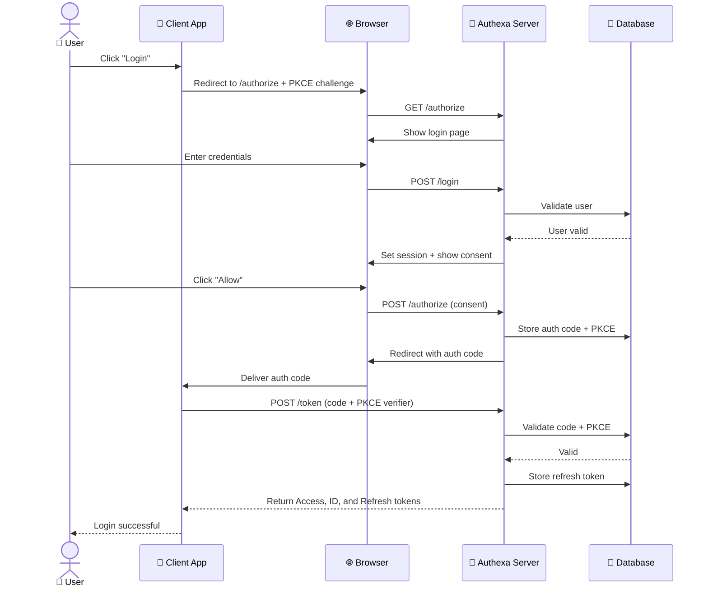

<p align="center">
  
</p>


<h1 align="center">🔐 Authexa - Go OAuth2 & OIDC Provider</h1>

<p align="center">
  <b>A blazing fast, production-ready OAuth2 and OpenID Connect (OIDC) Authorization Server built with 💙 Go, 🛢 MongoDB, and ⚡ Redis.</b>
</p>

<p align="center">
  <a href="https://golang.org/"></a>
  <a href="#"></a>
  <a href="#"></a>
  <a href="#"></a>
</p>

---
## Why This Project?

Authentication is the front door of every application. Most developers 
outsource it to Auth0, Okta, or Firebase — and pay thousands of dollars 
a month as they scale, while handing over their most sensitive user data 
to a third party.

This project gives you a **self-hosted alternative**. You own the server, 
you own the data, you own the keys.

Built from scratch against official IETF specifications — not wrapped 
around a library — **Authexa** is a full OAuth2 and OpenID Connect Authorization Server you can 
understand, audit, and extend yourself.

**Built for:**
- Startups who want auth infrastructure without the enterprise billing
- Teams with compliance requirements (HIPAA, GDPR) who can't 
     send user data to third parties  
- Developers who want to understand OAuth2 & OIDC by reading 
     real working code
- Engineers who need a fast, lightweight alternative to Keycloak


## What Is This?

This is a complete OAuth2 and OpenID Connect Authorization Server — 
the same kind of system that powers "Login with Google" — except you 
run it yourself, on your own infrastructure.

It handles login, consent, token issuance, and session management for 
all your applications from a single, central auth server.

### Supported Features

-   ✅ **OpenID Connect (OIDC) Support** (issues `id_token`)
-   ✅ **Authorization Code Flow** (with mandatory S256 PKCE for maximum security)
-   ✅ **Client Credentials Flow**
-   ✅ **Refresh Token Flow**
-   ✅ **Device Authorization Flow** (for TVs, CLI tools, and input-constrained devices)
-   ✅ **JWT Access & ID Tokens**
-   ✅ **Token Introspection & Revocation** (Inspect both JWTs and opaque refresh tokens)
-   ✅ **JWKS & Discovery Endpoints** (`/.well-known/...`)
-   ✅ **Admin Dashboard & HTML UI**
-   ✅ **Prometheus Metrics & Health Checks**



For a deep dive into the project's design, please see the **[Architecture Documentation](./docs/ARCHITECTURE.md)**.

## Quick Start (Docker Compose)

This is the fastest and recommended way to get the entire stack running.

### Prerequisites

-   [Docker](https://www.docker.com/get-started) & [Docker Compose](https://docs.docker.com/compose/install/)
-   [Go](https://go.dev/doc/install) (1.22+)
-   `openssl` (for generating secure secrets in production)

### 1. Configure Environment

Copy the example environment file. The default values are configured to work with Docker Compose out of the box.
```bash
cp .env.example .env
```
**Important**: For a real deployment, you must generate your own cryptographic secrets in the `.env` file (like `JWT_PRIVATE_KEY_BASE64`). See the [Setup Guide](./docs/SETUP.md) for details.

### 2. Build and Run the Stack

This single command will build the Go application, start MongoDB, start Redis, and run the server.
```bash
make docker-up
```

### 3. Verify and Access

-   **Check container status:**
    ```bash
    docker-compose -f docker/docker-compose.yml ps
    ```
-   **Authexa Server is running at:** `http://localhost:8080`
-   **Mongo Express (DB Admin) is at:** `http://localhost:8081`

### 4. Seed Initial Data

The database is currently empty. To log in and test the flows, you need to create an admin user and a test client.

For a complete script to do this via the Mongo Express UI or terminal, please follow the **[Database Seeding section in the Setup Guide](./docs/SETUP.md#5-database-seeding)**.

## Documentation Reference

This project includes comprehensive documentation for developers, administrators, and API consumers.

-   **[SETUP.md](./docs/SETUP.md)**: A detailed guide for setting up a local development environment.
-   **[ARCHITECTURE.md](./docs/ARCHITECTURE.md)**: An explanation of the project's structure and design patterns.
-   **[API.md](./docs/API.md)**: A complete technical reference for every API endpoint, updated for OIDC and Introspection capabilities.
-   **[FLOWS.md](./docs/FLOWS.md)**: Practical walkthroughs of each supported OAuth2 flow.
-   **[DEPLOYMENT.md](./docs/DEPLOYMENT.md)**: Instructions for deploying the application using Docker.

## Technology Stack

-   **Backend**: Go 1.22+ (`net/http`)
-   **Database**: MongoDB (Stores Clients, Users, Tokens, Audit Logs)
-   **Cache/Sessions**: Redis (Stores Sessions, Rate Limit Counters, PKCE Challenges)
-   **API Endpoints**: Standard Library `net/http` with `ServeMux`
-   **Frontend Templates**: Go `html/template`
-   **Observability**: Prometheus Metrics
